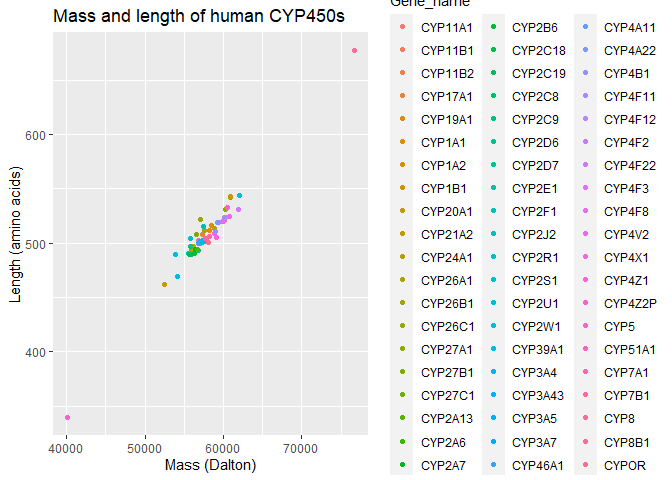
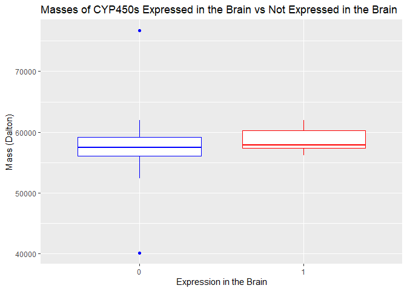
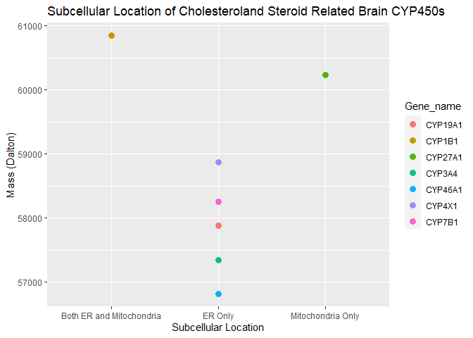

PM566_Midterm
================
Christina Lin
10/17/2021

# Exploring Cytochrome P450 Enzymes Found in the Human Brain

## Introduction

This project is based on my PhD thesis exploring the enzymes in the
brain that can produce the neurosteroid pregnenolone from cholesterol.
In classical steroid-producing organs such as the adrenals, pregnenolone
is metabolized from cholesterol by the cytochrome P450 (CYP450) enzyme
CYP11A1. However, CYP11A1 protein is difficult to detect in the brain
and preliminary experiments have revealed that a potential alternate
pathway not involving CYP11A1 is used by human brain cells to produce
pregnenolone. Therefore, this project will analyze known CYP450s in the
UniProt database to answer 2 main questions: 1) Which CYP450 enzymes are
expressed in the brain? 2) Which of those CYP450 enzymes are involved in
cholesterol/steroid metabolism?

## Methods

List of CYP450s were obtained from the UniProt database by searching
“cytochrome P450”. Additional filters were applied: “Homo
sapiens(human)” for species and “Reviewed” results to extract
information only from manually annotated records from literature and
curator-evaluated computational analysis. The columns of interest are
protein name, gene name, length (of protein), mass, tissue specificity,
cofactor, function, subcellular location, pathway, and sequence. The
[results](https://www.uniprot.org/uniprot/?query=cytochrome%20p450&fil=organism%3A%22Homo%20sapiens%20(Human)%20%5B9606%5D%22%20AND%20reviewed%3Ayes&columns=id%2Centry%20name%2Cprotein%20names%2Cgenes%2Corganism%2Clength%2Cmass%2Ccomment(TISSUE%20SPECIFICITY)%2Ccomment(COFACTOR)%2Ccomment(FUNCTION)%2Ccomment(SUBCELLULAR%20LOCATION)%2Ccomment(PATHWAY)%2Csequence&sort=score)
were downloaded as a CSV file.

### Data Wrangling

``` r
cyp450 <- fread("UniProt_hCYP450s.csv")
setnames(cyp450, "Gene names", "Gene_name")
setnames(cyp450, "Protein names", "Protein_name")
setnames(cyp450, "Function [CC]", "Function")
setnames(cyp450, "Subcellular location [CC]", "Subcellular_location")
setnames(cyp450, "Tissue specificity", "Tissue_expression")
```

Some enzymes have multiple gene names. For this analysis, only the first
gene name containing “CYP” will be used. Rows that do not have a gene
name starting with “CYP” are removed.

``` r
cyp450$Gene_name <- stringr::str_extract(cyp450$Gene_name, "CYP[[:alnum:]]+")
start_rows <- nrow(cyp450)
cyp450 <- cyp450[!is.na(Gene_name),]
end_rows <- nrow(cyp450)
```

The initial data table started with 82 proteins. After simplifying the
gene names and removing entries that do not have “CYP” in the gene name,
there are 62 proteins left.

Next, the “Mass” column will be converted to a numeric variable by
removing the “,” character and converting the values to integers.

``` r
cyp450$Mass <- stringr::str_remove_all(cyp450$Mass, ",")
cyp450$Mass <- as.integer(cyp450$Mass)
summary(cyp450$Mass)
```

    ##    Min. 1st Qu.  Median    Mean 3rd Qu.    Max. 
    ##   12413   56315   57501   56421   59206   76690

``` r
summary(cyp450$Length)
```

    ##    Min. 1st Qu.  Median    Mean 3rd Qu.    Max. 
    ##     118     494     503     495     519     677

When checking for the masses of the proteins, we see that the lowest
mass protein is 12413 Dalton and the shortest length protein is 118
amino acids. Since CYP450s are enzymes involved in complex metabolic
pathways and typically have multiple functional domains, these small
proteins are likely not CYP450 with cholesterol-metabolizing potential.
Therefore, proteins that are less than 35 000 Dalton in mass will be
removed.

``` r
cyp450 <- cyp450[Mass >= 35000,]
smallest <- cyp450[which.min(Mass),]
largest <- cyp450[which.max(Mass),]
```

To look for CYP450s that are expressed in the brains, terms such as
“brain”, “cerebellum”, “cerebral”,and “hippocampus” (i.e. common
references to different parts of the brain) will be used to filter the
observations. For easier search for key terms in later analysis, data
within Tissue_expression, Function, Subcellular_location, and Pathway
columns will all be converted to lower case.

``` r
cyp450 <- cyp450[, Tissue_expression := str_to_lower(Tissue_expression)]
cyp450 <- cyp450[, Function := str_to_lower(Function)]
cyp450 <- cyp450[, Subcellular_location := str_to_lower(Subcellular_location)]
cyp450 <- cyp450[, Pathway := str_to_lower(Pathway)]


brain_cyp450 <- cyp450[grep("brain|cerebellum|cerebral|hippocampus", Tissue_expression),]
brain_cyp450 <- brain_cyp450[, Brain := as.factor(1)]


non_brain_cyp450 <- cyp450[!grep("brain|cerebellum|cerebral|hippocampus", Tissue_expression),]
non_brain_cyp450 <- non_brain_cyp450[, Brain := as.factor(0)]
```

## Preliminary Results

The average mass of cyptochrome P450 enzymes found in humans is 57816.35
Dalton and the average length is 507.2 amino acids. The smallest CYP450
is CYP4Z2P, which is 40159 Dalton in mass and 340 amino acids in length.
The largest CYP450 is CYPOR, which is 76690 Dalton in mass and 677 amino
acids in length.

``` r
ggplot(cyp450, mapping=aes(x = Mass, y = Length, color = Gene_name)) +
  geom_point() +
  xlab("Mass (Dalton)") +
  ylab("Length (amino acids)") +
  ggtitle("Mass and length of human CYP450s")
```

<!-- -->

Figure 1: Correlation between mass and length of human CYP450s. As
expected, there is a positive linear correlation between mass and length
of CYP450 enzymes.

Out of the 60 CYP450 enzymes in humans, there are 13 CYP450s that are
expressed in the brain.

``` r
brain_summary <- brain_cyp450[,.(Gene_name, Protein_name, Length, Mass)]

knitr::kable(brain_summary)
```

| Gene_name | Protein_name                                                                                                                                                                                                                                                                                                                                                                                                                  | Length |  Mass |
|:----------|:------------------------------------------------------------------------------------------------------------------------------------------------------------------------------------------------------------------------------------------------------------------------------------------------------------------------------------------------------------------------------------------------------------------------------|-------:|------:|
| CYP3A4    | Cytochrome P450 3A4 (EC 1.14.14.1) (1,4-cineole 2-exo-monooxygenase) (1,8-cineole 2-exo-monooxygenase) (EC 1.14.14.56) (Albendazole monooxygenase (sulfoxide-forming)) (EC 1.14.14.73) (Albendazole sulfoxidase) (CYPIIIA3) (CYPIIIA4) (Cholesterol 25-hydroxylase) (Cytochrome P450 3A3) (Cytochrome P450 HLp) (Cytochrome P450 NF-25) (Cytochrome P450-PCN1) (Nifedipine oxidase) (Quinine 3-monooxygenase) (EC 1.14.14.55) |    503 | 57343 |
| CYP26B1   | Cytochrome P450 26B1 (EC 1.14.13.-) (Cytochrome P450 26A2) (Cytochrome P450 retinoic acid-inactivating 2) (Cytochrome P450RAI-2) (Retinoic acid-metabolizing cytochrome)                                                                                                                                                                                                                                                      |    512 | 57513 |
| CYP26A1   | Cytochrome P450 26A1 (EC 1.14.13.-) (Cytochrome P450 retinoic acid-inactivating 1) (Cytochrome P450RAI) (hP450RAI) (Retinoic acid 4-hydroxylase) (Retinoic acid-metabolizing cytochrome)                                                                                                                                                                                                                                      |    497 | 56199 |
| CYP19A1   | Aromatase (EC 1.14.14.14) (CYPXIX) (Cytochrome P-450AROM) (Cytochrome P450 19A1) (Estrogen synthase)                                                                                                                                                                                                                                                                                                                          |    503 | 57883 |
| CYP27A1   | Sterol 26-hydroxylase, mitochondrial (EC 1.14.15.15) (5-beta-cholestane-3-alpha,7-alpha,12-alpha-triol 26-hydroxylase) (Cytochrome P-450C27/25) (Cytochrome P450 27) (Sterol 27-hydroxylase) (Vitamin D(3) 25-hydroxylase)                                                                                                                                                                                                    |    531 | 60235 |
| CYP2D7    | Putative cytochrome P450 2D7 (EC 1.14.14.1)                                                                                                                                                                                                                                                                                                                                                                                   |    515 | 57489 |
| CYP46A1   | Cholesterol 24-hydroxylase (CH24H) (EC 1.14.14.25) (Cholesterol 24-monooxygenase) (Cholesterol 24S-hydroxylase) (Cytochrome P450 46A1)                                                                                                                                                                                                                                                                                        |    500 | 56821 |
| CYP2A13   | Cytochrome P450 2A13 (EC 1.14.14.1) (CYPIIA13)                                                                                                                                                                                                                                                                                                                                                                                |    494 | 56688 |
| CYP1B1    | Cytochrome P450 1B1 (EC 1.14.14.1) (CYPIB1) (Hydroperoxy icosatetraenoate dehydratase) (EC 4.2.1.152)                                                                                                                                                                                                                                                                                                                         |    543 | 60846 |
| CYP4X1    | Cytochrome P450 4X1 (EC 1.14.14.-) (CYPIVX1)                                                                                                                                                                                                                                                                                                                                                                                  |    509 | 58875 |
| CYP2U1    | Cytochrome P450 2U1 (Long-chain fatty acid omega-monooxygenase) (EC 1.14.14.80)                                                                                                                                                                                                                                                                                                                                               |    544 | 61987 |
| CYP7B1    | Cytochrome P450 7B1 (24-hydroxycholesterol 7-alpha-hydroxylase) (EC 1.14.14.26) (25/26-hydroxycholesterol 7-alpha-hydroxylase) (EC 1.14.14.29) (3-hydroxysteroid 7-alpha hydroxylase) (Oxysterol 7-alpha-hydroxylase)                                                                                                                                                                                                         |    506 | 58256 |
| CYP4V2    | Cytochrome P450 4V2 (Docosahexaenoic acid omega-hydroxylase CYP4V2) (EC 1.14.14.79) (Long-chain fatty acid omega-monooxygenase) (EC 1.14.14.80)                                                                                                                                                                                                                                                                               |    525 | 60724 |

Table 1: List of CYP450s expressed in the brain.

``` r
ggplot()+
  geom_boxplot(brain_cyp450, mapping = aes(x = Brain, y = Mass), color = "red") +
  geom_boxplot(non_brain_cyp450, mapping = aes(x = Brain, y = Mass), color = "blue") +
  xlab("Expression in the Brain") + ylab("Mass (Dalton)") + ggtitle("Masses of CYP450s Expressed in the Brain vs Not Expressed in the Brain")
```

<!-- -->

``` r
t.test(brain_cyp450$Mass, non_brain_cyp450$Mass)
```

    ## 
    ##  Welch Two Sample t-test
    ## 
    ## data:  brain_cyp450$Mass and non_brain_cyp450$Mass
    ## t = 1, df = 47, p-value = 0.3
    ## alternative hypothesis: true difference in means is not equal to 0
    ## 95 percent confidence interval:
    ##  -717 2533
    ## sample estimates:
    ## mean of x mean of y 
    ##     58528     57620

Figure 2: Box plots for masses of CYP450s expressed in the brain (red)
vs those that are not (blue). Distribution of the CYP450 masses are
similar between the two groups, with slightly more variation in the
non-brain CYP450 group. However, a t-test revealed no significant
differences between the average masses of brain CYP450s and non-brain
CYP450s.

Next, the brain CYP450s involved in cholesterol- or steroid-related
functions or pathways will be examined.

``` r
chol_function <- brain_cyp450[grep("cholesterol|steroid|hormone", Function),]
chol_pathway <- brain_cyp450[grep("cholesterol|steroid|hormone", Pathway),]

knitr::kable(chol_function$Gene_name, col.names = "Brain CYP450s with Cholesterol or Steroid Function")
```

| Brain CYP450s with Cholesterol or Steroid Function |
|:---------------------------------------------------|
| CYP3A4                                             |
| CYP19A1                                            |
| CYP27A1                                            |
| CYP46A1                                            |
| CYP1B1                                             |
| CYP4X1                                             |
| CYP7B1                                             |

``` r
knitr::kable(chol_pathway$Gene_name, col.names = "Brain CYP450s in Cholesterol or Steroid Pathways")
```

| Brain CYP450s in Cholesterol or Steroid Pathways |
|:-------------------------------------------------|
| CYP3A4                                           |
| CYP19A1                                          |
| CYP27A1                                          |
| CYP46A1                                          |
| CYP1B1                                           |
| CYP7B1                                           |

As seen from the tables above, we are able to capture more enzymes when
searching for CYP450s involved in cholesterol or steroid related
functions. Of the 13 CYP450 enzymes expressed in the brain, 7 of them
have functions relating to cholesterol or steroid hormones.

``` r
chol_function[, ER := grepl("endoplasmic\\sreticulum",Subcellular_location)]
chol_function[, Mitochondria := grepl("mitochondria|mitochondrion", Subcellular_location)]
chol_function[, Cytoplasm := grepl("cytoplasm|cytoplasmic", Subcellular_location)]

chol_function[, Organelle := ifelse(ER&Mitochondria, "Both ER and Mitochondria", 
                                  ifelse(Mitochondria, "Mitochondria Only", "ER Only"))]

ggplot(chol_function) +
  geom_point(mapping = aes(x = Organelle, y = Mass, color = Gene_name), size = 3) +
  xlab("Subcellular Location") + ylab ("Mass (Dalton)") + ggtitle("Subcellular Location of Cholesteroland Steroid Related Brain CYP450s")
```

<!-- --> Figure 3:
Subcellular location and masses of human CYP450s expressed in the brain
that are involved in cholesterol and steroid functions. The majority of
these enzymes are located in the endoplasmic reticulum. CYP27A1 is the
only one of these enzymes that is only located in the mitochondria while
CYP1B1 is found in both the endoplasmic reticulum and mitochondria. The
enzymes that localize to the mitochondria also appear to have higher
masses than those that are only found in the ER.

Therefore, the CYP450 enzymes of interest are listed in the table below.

``` r
interest <- chol_function[, .(Gene_name, Protein_name, Mass, Length, Organelle)]

knitr::kable(interest)
```

| Gene_name | Protein_name                                                                                                                                                                                                                                                                                                                                                                                                                  |  Mass | Length | Organelle                |
|:----------|:------------------------------------------------------------------------------------------------------------------------------------------------------------------------------------------------------------------------------------------------------------------------------------------------------------------------------------------------------------------------------------------------------------------------------|------:|-------:|:-------------------------|
| CYP3A4    | Cytochrome P450 3A4 (EC 1.14.14.1) (1,4-cineole 2-exo-monooxygenase) (1,8-cineole 2-exo-monooxygenase) (EC 1.14.14.56) (Albendazole monooxygenase (sulfoxide-forming)) (EC 1.14.14.73) (Albendazole sulfoxidase) (CYPIIIA3) (CYPIIIA4) (Cholesterol 25-hydroxylase) (Cytochrome P450 3A3) (Cytochrome P450 HLp) (Cytochrome P450 NF-25) (Cytochrome P450-PCN1) (Nifedipine oxidase) (Quinine 3-monooxygenase) (EC 1.14.14.55) | 57343 |    503 | ER Only                  |
| CYP19A1   | Aromatase (EC 1.14.14.14) (CYPXIX) (Cytochrome P-450AROM) (Cytochrome P450 19A1) (Estrogen synthase)                                                                                                                                                                                                                                                                                                                          | 57883 |    503 | ER Only                  |
| CYP27A1   | Sterol 26-hydroxylase, mitochondrial (EC 1.14.15.15) (5-beta-cholestane-3-alpha,7-alpha,12-alpha-triol 26-hydroxylase) (Cytochrome P-450C27/25) (Cytochrome P450 27) (Sterol 27-hydroxylase) (Vitamin D(3) 25-hydroxylase)                                                                                                                                                                                                    | 60235 |    531 | Mitochondria Only        |
| CYP46A1   | Cholesterol 24-hydroxylase (CH24H) (EC 1.14.14.25) (Cholesterol 24-monooxygenase) (Cholesterol 24S-hydroxylase) (Cytochrome P450 46A1)                                                                                                                                                                                                                                                                                        | 56821 |    500 | ER Only                  |
| CYP1B1    | Cytochrome P450 1B1 (EC 1.14.14.1) (CYPIB1) (Hydroperoxy icosatetraenoate dehydratase) (EC 4.2.1.152)                                                                                                                                                                                                                                                                                                                         | 60846 |    543 | Both ER and Mitochondria |
| CYP4X1    | Cytochrome P450 4X1 (EC 1.14.14.-) (CYPIVX1)                                                                                                                                                                                                                                                                                                                                                                                  | 58875 |    509 | ER Only                  |
| CYP7B1    | Cytochrome P450 7B1 (24-hydroxycholesterol 7-alpha-hydroxylase) (EC 1.14.14.26) (25/26-hydroxycholesterol 7-alpha-hydroxylase) (EC 1.14.14.29) (3-hydroxysteroid 7-alpha hydroxylase) (Oxysterol 7-alpha-hydroxylase)                                                                                                                                                                                                         | 58256 |    506 | ER Only                  |

## Conclusion

In this analysis, CYP450 enzymes that are expressed in the human brain
with functions related to cholesterol and steroid were extracted from a
data set containing all human CYP450s. There are 7 of such proteins,
which are CYP3A4, CYP19A1, CYP27A1, CYP46A1, CYP1B1, CYP4X1, CYP7B1.
